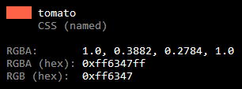

# colortool
*a [pytermfx][pytermfx]-based color conversion CLI*

[pytermfx]: https://github.com/loganzartman/pytermfx

## Usage
* Requires Python 3
* Requires pytermfx (`pip install pytermfx`)
* `python colortool.py`
* Type in a color
* Press enter to convert
